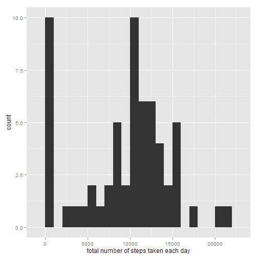
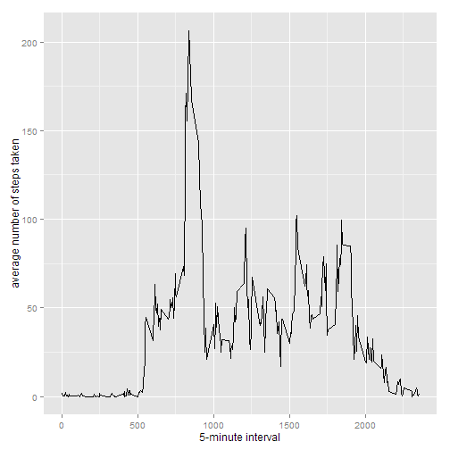
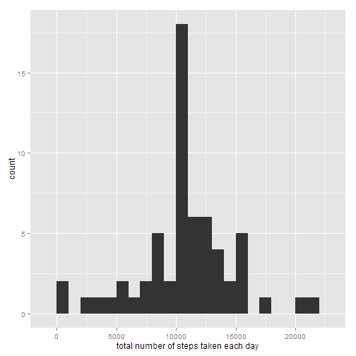
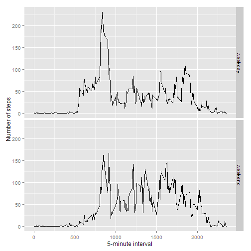

## Loading and preprocessing the data


```r
unzip(zipfile="activity.zip")
data <- read.csv("activity.csv")
```

## What is mean total number of steps taken per day?

Histogram of the total number of steps taken each day

```r
library(ggplot2)
```

```
## Warning: package 'ggplot2' was built under R version 3.1.3
```

```r
total.steps <- tapply(data$steps, data$date, FUN=sum, na.rm=TRUE)
qplot(total.steps, binwidth=1000, xlab="total number of steps taken each day")
```

 

The mean of the total number of steps taken per day

```r
mean(total.steps, na.rm=TRUE)
```

```
## [1] 9354.23
```

The median of the total number of steps taken per day

```r
median(total.steps, na.rm=TRUE)
```

```
## [1] 10395
```


## What is the average daily activity pattern?

Time series plot of the 5-minute interval (x-axis) and the average number of steps taken, averaged across all days (y-axis)

```r
averages <- aggregate(x = list(steps=data$steps), 
                      by = list(interval=data$interval),
                      FUN = "mean", 
                      na.rm = TRUE)

ggplot(data = averages, aes(x=interval, y=steps)) +
    geom_line() +
    xlab("5-minute interval") +
    ylab("average number of steps taken")
```

 

Which 5-minute interval, on average across all the days in the dataset, contains the maximum number of steps?

```r
print.table(averages[which.max(averages$steps),])
```

```
## interval    steps 
##      835 206.1698
```


## Imputing missing values


```r
missing <- sum(is.na(data$steps))
```
There are **2304** of days/intervals where there are missing values (coded as NA). The presence of missing days may introduce bias into some calculations or summaries of the data.

Let's fill all of the missing values  with mean value for that 5-minute
interval and create new dataset.


```r
fill.value <- function(steps, interval) {
    filled <- NA
    if (!is.na(steps))
        filled <- c(steps)
    else
        filled <- (averages[averages$interval==interval, "steps"])
    return(filled)
}
filled.data <- data
filled.data$steps <- mapply(fill.value, filled.data$steps, filled.data$interval)
```

With new dataset, let's make a histogram of the total number of steps taken each day and calculate the mean and median total number of steps.


```r
total.steps <- tapply(filled.data$steps, filled.data$date, FUN=sum)
qplot(total.steps, binwidth=1000, xlab="total number of steps taken each day")
```

 

```r
mean(total.steps)
```

```
## [1] 10766.19
```

```r
median(total.steps)
```

```
## [1] 10766.19
```

Replacing NAs with mean values results in more smoth histogram and less mean/median diference.

## Are there differences in activity patterns between weekdays and weekends?

For new dataset with filled missing values we create a new factor variable with two levels – “weekday” and “weekend” indicating whether a given date is a weekday or weekend day.


```r
Sys.setlocale("LC_TIME", "us_US")
```

```
## [1] "English_United States.1252"
```

```r
weekday.or.weekend <- function(date) {
    day <- weekdays(date)
    if (day %in% 
                c("Monday", "Tuesday", "Wednesday", "Thursday", "Friday"))
        return("weekday")
    else 
        return("weekend")
}
filled.data$date <- as.Date(filled.data$date)
filled.data$day <- sapply(filled.data$date, FUN=weekday.or.weekend)
```

Let's make a  panel plot containing a time series plot (i.e. type = "l") of the 5-minute interval (x-axis) and the average number of steps taken, averaged across all weekday days or weekend days (y-axis).

```r
averages <- aggregate(steps ~ interval + day, data=filled.data, mean)
ggplot(averages, aes(interval, steps)) + geom_line() + facet_grid(day ~ .) +
    xlab("5-minute interval") + ylab("Number of steps")
```

 
